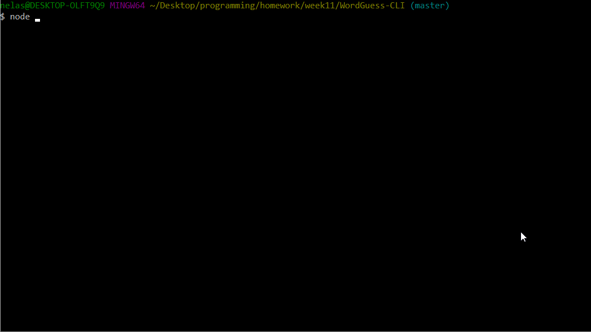
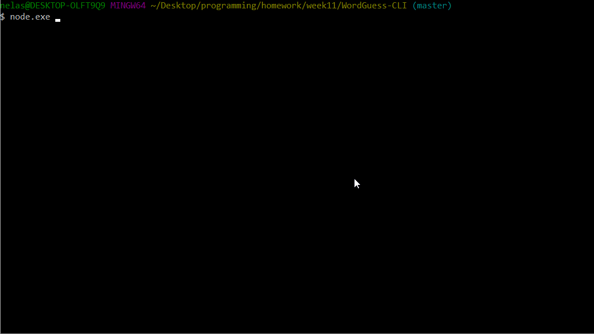

# WordGuess-CLI

##### To start this app on your machine:
* Pull this repo
* In your bash type: 'npm install -y'
* Your WordGuess-CLI is ready to use, just type in: 'node game.js'

Word-Guess command line interface game based on JavaScript constructors.

Every time user starts the game he is offered to guess the name of a state or territory of the United States

Type 'node game.js' in your command line to begin the game.

Every time you guess a letter, type it in and press Enter to check if your guess is right

##Typical gameflow:

* Each round user is given 8 wrong guesses before he loses. If user runs out of attempts, he gets a message about his loss and the right word in the CLI.

* If user guesses all the letters right, he gets a win message on the screen and an option to play again or quit

_This CLI application was created using following technologies:_
* **Node**
* **JavaScript**
* **Following NPM packages:**
    * "inquirer"
    * "colors"

